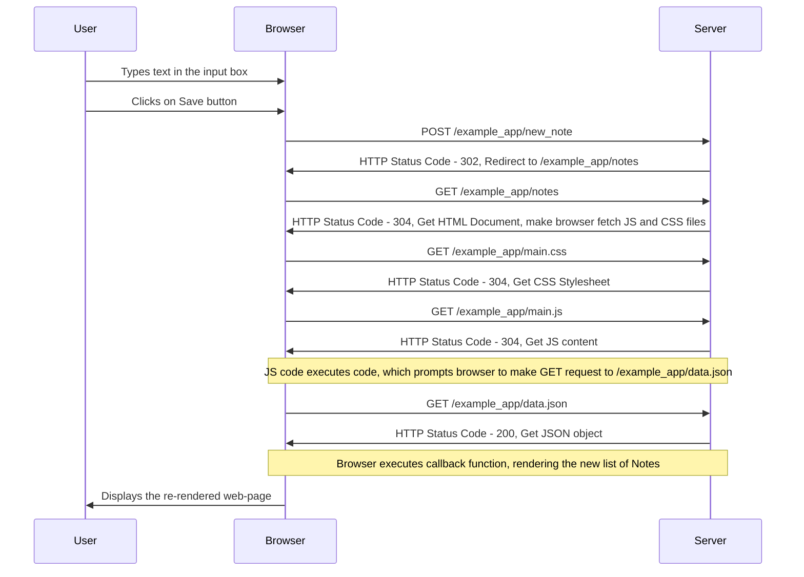

```mermaid
    sequenceDiagram
        participant User
        participant Browser
        participant Server

        User ->> Browser: Types text in the input box
        User ->> Browser: Clicks on Save button
        Browser->>Server: POST /example_app/new_note
        Server ->> Browser: HTTP Status Code - 302, Redirect to /example_app/notes
        Browser ->> Server: GET /example_app/notes
        Server ->> Browser: HTTP Status Code - 304, Get HTML Document, make browser fetch JS and CSS files
        Browser ->> Server: GET /example_app/main.css
        Server ->> Browser: HTTP Status Code - 304, Get CSS Stylesheet
        Browser ->> Server: GET /example_app/main.js
        Server ->> Browser: HTTP Status Code - 304, Get JS content
        Note over Browser, Server: JS code executes code, which prompts browser to make GET request to /example_app/data.json
        Browser ->> Server: GET /example_app/data.json
        Server ->> Browser: HTTP Status Code - 200, Get JSON object 
        Note over Browser, Server: Browser executes callback function, rendering the new list of Notes
        Browser ->> User: Displays the re-rendered web-page
```