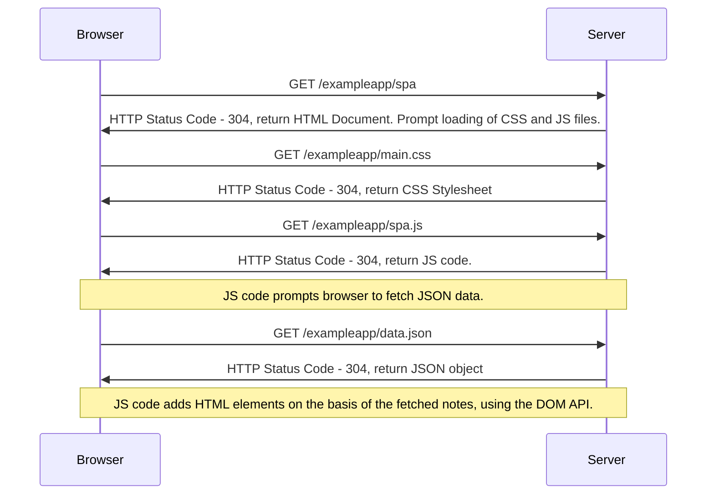

```mermaid
    sequenceDiagram
        participant Browser
        participant Server

        Browser ->> Server: GET /exampleapp/spa
        Server ->> Browser: HTTP Status Code - 304, return HTML Document. Prompt loading of CSS and JS files.
        Browser ->> Server: GET /exampleapp/main.css
        Server ->> Browser: HTTP Status Code - 304, return CSS Stylesheet
        Browser ->> Server: GET /exampleapp/spa.js
        Server ->> Browser: HTTP Status Code - 304, return JS code.
        Note over Server, Browser: JS code prompts browser to fetch JSON data.
        Browser ->> Server: GET /exampleapp/data.json
        Server ->> Browser: HTTP Status Code - 304, return JSON object
        Note over Server, Browser: JS code adds HTML elements on the basis of the fetched notes, using the DOM API.
```