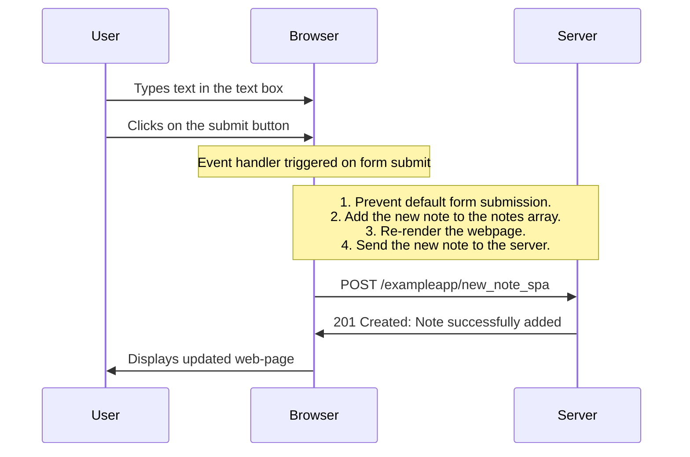

```mermaid
sequenceDiagram
    participant User
    participant Browser
    participant Server

    User ->> Browser: Types text in the text box
    User ->> Browser: Clicks on the submit button
    Note over Browser: Event handler triggered on form submit
    Note over Browser, Server: 1. Prevent default form submission.<br> 2. Add the new note to the notes array.<br> 3. Re-render the webpage.<br> 4. Send the new note to the server.
    Browser ->> Server: POST /exampleapp/new_note_spa
    Server ->> Browser: 201 Created: Note successfully added
    Browser ->> User: Displays updated web-page
```